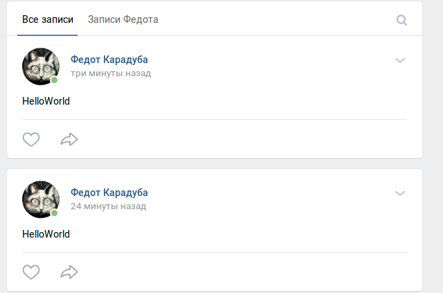

# 1.Базовая часть работы

## 1.2.1. Запрос OPTIONS
#### mail.ru
##### Headers

```
Date →Fri, 14 Jun 2019 22:27:59 GMT
Content-Type →text/html; charset=utf-8
Transfer-Encoding →chunked
Connection →keep-alive
Cache-Control →no-cache,no-store,must-revalidate
Pragma →no-cache
Expires →Thu, 14 Jun 2018 22:27:59 GMT
Last-Modified →Sat, 15 Jun 2019 01:27:59 GMT
Content-Security-Policy →default-src mail.ru *.mail.ru *.imgsmail.ru *.mradx.net *.serving-sys.com *.moatads.com *.doubleverify.com *.adsafeprotected.com; script-src 'unsafe-inline' 'unsafe-eval' mail.ru *.mail.ru *.imgsmail.ru *.mradx.net *.odnoklassniki.ru ok.ru *.doubleverify.com *.dvtps.com *.doubleclick.net *.googletagservices.com *.googlesyndication.com *.googleadservices.com *.moatads.com *.adlooxtracking.com *.adsafeprotected.com *.serving-sys.com; img-src data: blob: *; style-src 'unsafe-inline' 'unsafe-eval' blob: *.mail.ru *.imgsmail.ru *.mradx.net; font-src data: blob: https: *.mail.ru *.imgsmail.ru *.mradx.net; frame-src mail.ru *.mail.ru *.mradx.net *.doubleverify.com *.doubleclick.net ok.ru *.ok.ru; child-src mail.ru *.mail.ru *.mradx.net *.doubleverify.com *.doubleclick.net ok.ru *.ok.ru; report-uri https://cspreport.mail.ru/splash;
X-Frame-Options →SAMEORIGIN
X-XSS-Protection →1; mode=block; report=https://cspreport.mail.ru/xxssprotection
X-Content-Type-Options →nosniff
Strict-Transport-Security →max-age=16070400
Content-Encoding →gzip
```
##### body
```
<!DOCTYPE html>
<html id="nojs" lang="ru" class=" nonRetina">
    <head>
        <!--MAIL.RU-->
        <meta http-equiv="X-UA-Compatible" content="IE=edge"/>
        <meta charset="utf-8"/>
        <title>Mail.Ru: почта, поиск в интернете, новости, игры</title>
        <meta name="description" content="Почта Mail.Ru — крупнейшая бесплатная почта, быстрый и удобный интерфейс, неограниченный объем ящика, надежная защита от спама и вирусов, мобильная версия и приложения для смартфонов. Доступ по IMAP, SMS-уведомления, интерфейс на разных языках и темы оформления Почты. Также на Mail.Ru: новости, поиск в интернете, авто, спорт, игры, знакомства, погода, работа."/>
        <meta name="keywords" content="почта, создать почту, почтовый ящик, почта для телефона, регистрация в почте, бесплатная электронная почта, новости, поиск в интернете, авто, спорт, игры, знакомства, погода, работа"/>
        <meta name="viewport" content="width=device-width, minimum-scale=1, initial-scale=1, maximum-scale=4"/>
        <meta name="referrer" content="always"/>
        <link rel="shortcut icon" type="image/x-icon" href="//limg.imgsmail.ru/splash/v/i/favicon-fp-5297110e39.ico"/>
        <link rel="apple-touch-icon-precomposed" sizes="144x144" href="//limg.imgsmail.ru/splash/v/i/apple-touch-icon-144x144-fp-22d2f7eb2b.png"/>
        <link rel="apple-touch-icon-precomposed" sizes="114x114" href="//limg.imgsmail.ru/splash/v/i/apple-touch-icon-114x114-fp-6bb5fc792e.png"/>
        <link rel="apple-touch-icon-precomposed" sizes="72x72" href="//limg.imgsmail.ru/splash/v/i/apple-touch-icon-72x72-fp-e1a6282db8.png"/>
        <link rel="apple-touch-icon-precomposed" href="//limg.imgsmail.ru/splash/v/i/apple-touch-icon-57x57-fp-2beda16a11.png"/>
        <link id="default-webstore-link" rel="chrome-webstore-item" href="https://chrome.google.com/webstore/detail/egfgboclmgbokjeenpnghneoaogefnjn"/>
        <meta property="fb:app_id" content="1438438409712230"/>
        <meta property="og:url" content="https://mail.ru"/>
        <meta property="og:type" content="website"/>
        <meta property="og:title" content="Mail.Ru: почта, поиск в интернете, новости, игры"/>
        <meta property="vk:image" content="https://limg.imgsmail.ru/splash/v/i/share-fp-a2954bf3df.png"/>
        <meta property="og:image" content="https://limg.imgsmail.ru/splash/v/i/share-fp-a2954bf3df.png"/>
        <meta property="og:description" content="Mail.Ru — крупнейшая бесплатная почта, быстрый и удобный интерфейс, неограниченный объем ящика, надежная защита от спама и вирусов, мобильная версия и приложения для смартфонов. Также на Mail.Ru: новости, поиск в интернете, игры, авто, спорт, знакомства, погода, работа"/>
```

#### ya.ru
##### Headers
```
Date →Fri, 14 Jun 2019 22:33:02 GMT
Content-Type →text/html; charset=utf-8
ETag →W/"5d0252da-3077"
Content-Encoding →gzip
X-Content-Type-Options →nosniff
Transfer-Encoding →chunked
```
##### body
```
<!DOCTYPE HTML>
<html lang="ru">
    <head>
        <meta http-equiv="Content-Type" content="text/html;charset=UTF-8">
        <title>Яндекс</title>
        <link rel="shortcut icon" href="">
        <style type="text/css">
body, div, ul, table, tr, td, form, input {
    margin: 0;
    padding: 0
}

body {
    font: .8em Arial, sans-serif;
    color: #000;
    background: #fff;
}
```

#### rambler.ru
##### headers
```
Server →nginx
Date →Fri, 14 Jun 2019 22:34:51 GMT
Content-Type →text/html; charset=utf-8
Transfer-Encoding →chunked
Connection →keep-alive
Keep-Alive →timeout=50
Last-Modified →Wed, 29 May 2019 11:01:34 GMT
Vary →Accept-Encoding
ETag →W/"5cee668e-2ae9"
Content-Encoding →gzip
X-Cache →HIT
Set-Cookie →ruid=vAsAAAshBF2ZUso1AVN7AAB=; expires=Thu, 31-Dec-37 23:55:55 GMT; domain=.rambler.ru; path=/
P3P →CP="NON DSP NID ADMa DEVa TAIa PSAa PSDa OUR IND UNI COM NAV"
```
##### body
```
<!DOCTYPE html>
<html class="no-js" lang="">
    <head>
        <meta charset="utf-8">
        <meta http-equiv="x-ua-compatible" content="ie=edge">
        <title>403 error</title>
        <meta name="description" content="">
        <meta name="viewport" content="width=device-width, initial-scale=1">
        <link rel="apple-touch-icon" sizes="57x57" href="/errorpage_assets/favicon/apple-touch-icon-57x57.png" />
        <link rel="apple-touch-icon" sizes="60x60" href="/errorpage_assets/favicon/apple-touch-icon-60x60.png" />
        <link rel="apple-touch-icon" sizes="72x72" href="/errorpage_assets/favicon/apple-touch-icon-72x72.png" />
        <link rel="apple-touch-icon" sizes="76x76" href="/errorpage_assets/favicon/apple-touch-icon-76x76.png" />
        <link rel="apple-touch-icon" sizes="114x114" href="/errorpage_assets/favicon/apple-touch-icon-114x114.png" />
        <link rel="apple-touch-icon" sizes="120x120" href="/errorpage_assets/favicon/apple-touch-icon-120x120.png" />
        <link rel="apple-touch-icon" sizes="144x144" href="/errorpage_assets/favicon/apple-touch-icon-144x144.png" />
        <link rel="apple-touch-icon" sizes="152x152" href="/errorpage_assets/favicon/apple-touch-icon-152x152.png" />
        <link rel="apple-touch-icon" sizes="180x180" href="/errorpage_assets/favicon/apple-touch-icon-180x180.png" />
        <link rel="icon" type="image/png" href="/errorpage_assets/favicon/favicon-32x32.png" sizes="32x32" />
        <link rel="icon" type="image/png" href="/errorpage_assets/favicon/android-chrome-192x192.png" sizes="192x192" />
        <link rel="icon" type="image/png" href="/errorpage_assets/favicon/favicon-96x96.png" sizes="96x96" />
        <link rel="icon" type="image/png" href="/errorpage_assets/favicon/favicon-16x16.png" sizes="16x16" />
        <link rel="manifest" href="/errorpage_assets/favicon/manifest.json" />
        <link rel="mask-icon" href="/errorpage_assets/favicon/safari-pinned-tab.svg" color="#315efb" />
        <link rel="manifest" href="site.webmanifest">
        <link rel="apple-touch-icon" href="icon.png">
        <link rel="stylesheet" href="/errorpage_assets/main.css?v1.1.0">
  
    </head>
    <body>
        <script src="//st.top100.ru/top100/top100.js" async></script>
        <script src="/errorpage_assets/main.js?v1.1.0"></script>
        <!-- [if IE] 
        <!-->
        <script>
      !function(e,t){var n=t.createElement("script"),r=t.scripts,i=r[r.length-1];n.src=e,n.id="rambler-topline-injector",i.parentNode.insertBefore(n,i.nextSibling)}
      ("//topline.rambler.ru/new/latest/bundle.js",document);
    </script>
        <!--if IE
    | >[endif]
    
    -->
        <script type="text/javascript" src="//ssp.rambler.ru/capirs.js"></script>
        <div class="wrapper">
            <div class="error-body">
                <div class="error-inner">
                    <div class="icon" style="background-image: url(/errorpage_assets/images/403.svg)"></div>
                    <div class="inner">
                        <h1 class="error-title">Доступ запрещен</h1>
                        <div class="error-text">
                            <p>Поздравляем, вы нашли тайную дверь.</p>
                            <p>Но дальше вы пройти не сможете.</p>
                            <p>Попробуйте начать заново с главной&nbsp;
                                <a href="https://rambler.ru">Рамблера</a>
                            </p>
```

#### google.com
##### headers
```
Allow →GET, HEAD
Date →Fri, 14 Jun 2019 22:46:48 GMT
Content-Type →text/html; charset=UTF-8
Server →gws
Content-Length →1592
X-XSS-Protection →0
X-Frame-Options →SAMEORIGIN
Alt-Svc →quic=":443"; ma=2592000; v="46,44,43,39"
```

##### body
```
<!DOCTYPE html>
<html lang=en>
    <meta charset=utf-8>
    <meta name=viewport content="initial-scale=1, minimum-scale=1, width=device-width">
    <title>Error 405 (Method Not Allowed)!!1</title>
    <style>
    *{margin:0;padding:0}html,code{font:15px/22px arial,sans-serif}html{background:#fff;color:#222;padding:15px}body{margin:7% auto 0;max-width:390px;min-height:180px;padding:30px 0 15px}* > body{background:url(//www.google.com/images/errors/robot.png) 100% 5px no-repeat;padding-right:205px}p{margin:11px 0 22px;overflow:hidden}ins{color:#777;text-decoration:none}a img{border:0}@media screen and (max-width:772px){body{background:none;margin-top:0;max-width:none;padding-right:0}}#logo{background:url(//www.google.com/images/branding/googlelogo/1x/googlelogo_color_150x54dp.png) no-repeat;margin-left:-5px}@media only screen and (min-resolution:192dpi){#logo{background:url(//www.google.com/images/branding/googlelogo/2x/googlelogo_color_150x54dp.png) no-repeat 0% 0%/100% 100%;-moz-border-image:url(//www.google.com/images/branding/googlelogo/2x/googlelogo_color_150x54dp.png) 0}}@media only screen and (-webkit-min-device-pixel-ratio:2){#logo{background:url(//www.google.com/images/branding/googlelogo/2x/googlelogo_color_150x54dp.png) no-repeat;-webkit-background-size:100% 100%}}#logo{display:inline-block;height:54px;width:150px}
  </style>
    <a href=//www.google.com/>
    <span id=logo aria-label=Google></span>
</a>
<p>
    <b>405.</b>
    <ins>That’s an error.</ins>
    <p>The request method 
        <code>OPTIONS</code> is inappropriate for the URL
        <code>/</code>.
        <ins>That’s all we know.</ins>
```

#### github.com
##### headers
```
Date →Fri, 14 Jun 2019 22:48:20 GMT
Content-Type →text/html; charset=utf-8
Content-Length →0
Server →GitHub.com
Status →404 Not Found
X-Request-Id →bdc62ccb-f674-481e-86f4-002f02801451
Strict-Transport-Security →max-age=31536000; includeSubdomains; preload
X-Frame-Options →deny
X-Content-Type-Options →nosniff
X-XSS-Protection →1; mode=block
Referrer-Policy →origin-when-cross-origin, strict-origin-when-cross-origin
Expect-CT →max-age=2592000, report-uri="https://api.github.com/_private/browser/errors"
Content-Security-Policy →default-src 'none'; base-uri 'self'; block-all-mixed-content; connect-src 'self' uploads.github.com www.githubstatus.com collector.githubapp.com api.github.com www.google-analytics.com github-cloud.s3.amazonaws.com github-production-repository-file-5c1aeb.s3.amazonaws.com github-production-upload-manifest-file-7fdce7.s3.amazonaws.com github-production-user-asset-6210df.s3.amazonaws.com; font-src github.githubassets.com; form-action 'self' github.com gist.github.com; frame-ancestors 'none'; frame-src render.githubusercontent.com; img-src 'self' data: github.githubassets.com media.githubusercontent.com camo.githubusercontent.com identicons.github.com collector.githubapp.com avatars0.githubusercontent.com avatars1.githubusercontent.com avatars2.githubusercontent.com avatars3.githubusercontent.com github-cloud.s3.amazonaws.com; manifest-src 'self'; media-src 'none'; script-src github.githubassets.com; style-src 'unsafe-inline' github.githubassets.com
X-GitHub-Request-Id →EDF4:2F5EF:26DD1F3:3B4FE2A:5D042434
```
##### body
```
non
```

#### apple.com
##### headers
```
Server →Apache
Content-Type →text/html; charset=UTF-8
ETag →"KXKKJLLKHIOZVOUZW"
Vary →Accept-Encoding
Strict-Transport-Security →max-age=31536000; includeSubDomains
X-Content-Type-Options →nosniff
X-Xss-Protection →1; mode=block
X-Frame-Options →SAMEORIGIN
Content-Encoding →gzip
Cache-Control →max-age=0
Expires →Fri, 14 Jun 2019 22:49:52 GMT
Date →Fri, 14 Jun 2019 22:49:52 GMT
Content-Length →8747
Connection →keep-alive
```
##### body
 ```
 non
 ```
 

*
----
> ***Для чего используется запрос OPTIONS?***

> OPTIONS Используется для определения возможностей веб-сервера или параметров соединения для конкретного ресурса. В ответ серверу следует включить заголовок Allow со списком поддерживаемых методов. Также в заголовке ответа может включаться информация о поддерживаемых расширениях.
Предполагается, что запрос клиента может содержать тело сообщения для указания интересующих его сведений. Формат тела и порядок работы с ним в настоящий момент не определён; сервер пока должен его игнорировать. Аналогичная ситуация и с телом в ответе сервера. 
 

> ***Какие коды ответов приходят при этом запросе?***

>200 OK - запрос успешно обработан. Если клиентом были запрошены какие-либо данные, то они находятся в заголовке и/или теле сообщения. Появился в HTTP/1.0.

>403 Forbidden - сервер понял запрос, но он отказывается его выполнять из-за ограничений в доступе для клиента к указанному ресурсу. Иными словами, клиент не уполномочен совершать операции с запрошенным ресурсом. Если для доступа к ресурсу требуется аутентификация средствами HTTP, то сервер вернёт ответ `401`, или `407` при использовании прокси. В противном случае ограничения были заданы администратором сервера или разработчиком веб-приложения и могут быть любыми в зависимости от возможностей используемого программного обеспечения. В любом случае клиенту следует сообщить причины отказа в обработке запроса.

>405 Method Not Allowed - указанный клиентом метод нельзя применить к текущему ресурсу. В ответе сервер должен указать доступные методы в заголовке `Allow`, разделив их запятой. Эту ошибку сервер должен возвращать, если метод ему известен, но он не применим именно к указанному в запросе ресурсу, если же указанный метод не применим на всём сервере, то клиенту нужно вернуть код 501 (Not Implemented). 

>***Какие сайты правильно обработали запрос и вернули ожидаемые данные?***

> + mail.ru
> + ya.ru

---
## 1.2.2. Запрос HEAD
#### headers vk.com
```
Server →VK
Date →Fri, 14 Jun 2019 22:50:54 GMT
Content-Length →0
Connection →keep-alive
X-Frontend →front204302
Access-Control-Expose-Headers →X-Frontend
```
#### headers apple.com
```
Server →Apache
X-Frame-Options →SAMEORIGIN
X-Xss-Protection →1; mode=block
Accept-Ranges →bytes
X-Content-Type-Options →nosniff
Content-Type →text/html; charset=UTF-8
Strict-Transport-Security →max-age=31536000; includeSubDomains
Content-Encoding →gzip
Content-Length →9592
Cache-Control →max-age=428
Expires →Fri, 14 Jun 2019 22:59:09 GMT
Date →Fri, 14 Jun 2019 22:52:01 GMT
Connection →keep-alive
Vary →Accept-Encoding
```
#### headers msn.com
```
Cache-Control →no-cache, no-store, no-transform
Pragma →no-cache
Content-Length →15944
Content-Type →text/html; charset=utf-8
Content-Encoding →gzip
Expires →-1
Vary →User-Agent
Set-Cookie →PreferencesMsn=eyJIb21lUGFnZSI6eyJTdHJpcGVzIjpbXSwiTWVTdHJpcGVNb2R1bGVzIjpbXSwiTWFya2V0Q29uZmlndXJhdGlvbiI6eyJNYXJrZXQiOiJydS1ydSIsIlN1cHByZXNzUHJvbXB0IjpmYWxzZSwiUHJlZmVycmVkTGFuZ3VhZ2VDb2RlIjoicnUtcnUiLCJDb3VudHJ5Q29kZSI6IlJVIn19LCJFeHBpcnlUaW1lIjo2MzcyNzc3MjAwMzU5OTYzOTQsIlZlcnNpb24iOjF90; domain=msn.com; expires=Sun, 14-Jun-2020 22:53:23 GMT; path=/; HttpOnly
Set-Cookie →marketPref=ru-ru; domain=msn.com; expires=Sun, 14-Jun-2020 22:53:23 GMT; path=/; HttpOnly
Set-Cookie →_EDGE_S=F=1; path=/; httponly; domain=msn.com
Set-Cookie →_EDGE_V=1; path=/; httponly; expires=Wed, 08-Jul-2020 22:53:23 GMT; domain=msn.com
Set-Cookie →MUID=270EF5CE38676E2C2A74F8B5394F6F46; path=/; expires=Wed, 08-Jul-2020 22:53:23 GMT; domain=msn.com
Access-Control-Allow-Origin →*
X-AspNetMvc-Version →5.2
X-AppVersion →20190612_16415776
X-Activity-Id →3a711ec2-f4eb-4df4-a452-997fdb20823b
X-Az →{did:b24a0ea2b3ba45a59fc1d4d299c5ebc1, rid: 36, sn: neurope-prod-hp, dt: 2019-06-03T17:49:45.3767376Z, bt: 2019-06-13T00:13:16.6299629Z}
X-UA-Compatible →IE=Edge;chrome=1
X-Content-Type-Options →nosniff
X-FRAME-OPTIONS →SAMEORIGIN
X-Powered-By →ASP.NET
Access-Control-Allow-Methods →HEAD,GET,OPTIONS
X-XSS-Protection →1
X-MSEdge-Ref →Ref A: 3A711EC2F4EB4DF4A452997FDB20823B Ref B: STOEDGE1014 Ref C: 2019-06-14T22:53:23Z
Date →Fri, 14 Jun 2019 22:53:22 GMT
```
*
---
> ***Для чего нужен запрос HEAD?***

>Метод HEAD аналогичен методу GET, за исключением того, что сервер ничего не посылает в информационной части ответа. Метод HEAD запрашивает только информацию заголовка о файле или ресурсе. Информация заголовка запроса HEAD должна быть такой же, как в запросе GET. Этот метод используется, когда клиент хочет найти информацию о документе, не получая его.

> ***Какой сайт прислал ожидаемый ответ?***

> - vk
> - apple
> - msn

---
## 1.2.3. Запросы GET и POST
> ***Отправьте по запросу на yandex.ru, google.com и apple.com. Что они вернули? Что содержится в теле ответа?***
    
#### yandex.ru GET
#####  headers
```
Date →Fri, 14 Jun 2019 22:54:08 GMT
Content-Type →text/html; charset=UTF-8
Cache-Control →no-cache,no-store,max-age=0,must-revalidate
Expires →Fri, 14 Jun 2019 22:54:08 GMT
Last-Modified →Fri, 14 Jun 2019 22:54:08 GMT
Content-Security-Policy →connect-src 'self' wss://webasr.yandex.net https://mc.webvisor.com https://mc.webvisor.org wss://push.yandex.ru wss://portal-xiva.yandex.net https://yastatic.net https://home.yastatic.net https://yandex.ru https://*.yandex.ru static.yandex.sx brotli.yastatic.net et.yastatic.net *.serving-sys.com an.yandex.ru awaps.yandex.ru storage.mds.yandex.net music.yandex.ru music-browser.music.yandex.net mc.admetrica.ru msk-cdn-exp.yastatic.net msk-cdn-etl.yastatic.net yastat.net br.yastatic.net portal-xiva.yandex.net yastatic.net home.yastatic.net yandex.ru *.yandex.ru *.yandex.net yandex.st; default-src 'self' blob: wss://portal-xiva.yandex.net yastatic.net portal-xiva.yandex.net; font-src 'self' https://yastatic.net zen.yandex.ru static.yandex.sx brotli.yastatic.net et.yastatic.net yabro1.zen-test.yandex.ru main.zdevx.yandex.ru msk-cdn-exp.yastatic.net msk-cdn-etl.yastatic.net yastat.net br.yastatic.net yastatic.net; frame-src 'self' yabrowser: data: https://www.youtube.com https://player.video.yandex.net https://ya.ru https://ok.ru https://yastatic.net https://yandex.ru https://*.yandex.ru https://downloader.yandex.net wfarm.yandex.net secure-ds.serving-sys.com yandexadexchange.net *.yandexadexchange.net music.yandex.ru music.yandex.kz yastatic.net yandex.ru *.yandex.ru awaps.yandex.net *.cdn.yandex.net; img-src 'self' data: https://yastatic.net https://home.yastatic.net https://*.yandex.ru https://*.yandex.net https://*.tns-counter.ru awaps.yandex.net *.yastatic.net gdeua.hit.gemius.pl pa.tns-ua.com mc.yandex.com mc.webvisor.com mc.webvisor.org static.yandex.sx brotli.yastatic.net et.yastatic.net *.moatads.com avatars.mds.yandex.net bs.serving-sys.com an.yandex.ru awaps.yandex.ru nissanhelioseurope.demdex.net mc.admetrica.ru msk-cdn-exp.yastatic.net msk-cdn-etl.yastatic.net yastat.net br.yastatic.net *.yandex.net resize.yandex.net yastatic.net home.yastatic.net yandex.ru *.yandex.ru *.tns-counter.ru yandex.st; media-src 'self' blob: data: *.storage.yandex.net *.yandex.net strm.yandex.ru strm.yandex.net *.strm.yandex.net *.cdn.yandex.net storage.mds.yandex.net *.storage.mds.yandex.net yastatic.net kiks.yandex.ru; object-src 'self' *.yandex.net music.yandex.ru strm.yandex.ru flashservice.adobe.com yastatic.net kiks.yandex.ru awaps.yandex.net storage.mds.yandex.net; report-uri https://csp.yandex.net/csp?project=morda&from=morda.big.ru&showid=1560552847.96528.141501.805620&h=man2-5342-aba-man-portal-morda-29675&csp=old&date=20190615&yandexuid=3422447781560552847; script-src 'self' 'unsafe-inline' 'unsafe-eval' blob: https://suburban-widget.rasp.yandex.ru https://suburban-widget.rasp.yandex.net https://music.yandex.ru https://mc.yandex.fr https://mc.webvisor.com https://yandex.fr https://mc.webvisor.org https://yastatic.net https://home.yastatic.net https://mc.yandex.ru https://pass.yandex.ru zen.yandex.ru an.yandex.ru api-maps.yandex.ru static.yandex.sx webasr.yandex.net brotli.yastatic.net et.yastatic.net z.moatads.com bs.serving-sys.com secure-ds.serving-sys.com yabro1.zen-test.yandex.ru main.zdevx.yandex.ru awaps.yandex.ru storage.mds.yandex.net msk-cdn-exp.yastatic.net msk-cdn-etl.yastatic.net yastat.net br.yastatic.net yastatic.net home.yastatic.net yandex.ru www.yandex.ru mc.yandex.ru suggest.yandex.ru clck.yandex.ru awaps.yandex.net; style-src 'self' 'unsafe-inline' https://yastatic.net https://home.yastatic.net zen.yandex.ru static.yandex.sx brotli.yastatic.net et.yastatic.net yabro1.zen-test.yandex.ru main.zdevx.yandex.ru msk-cdn-exp.yastatic.net msk-cdn-etl.yastatic.net yastat.net br.yastatic.net yastatic.net home.yastatic.net;
P3P →policyref="/w3c/p3p.xml", CP="NON DSP ADM DEV PSD IVDo OUR IND STP PHY PRE NAV UNI"
Set-Cookie →yp=1563144848.ygu.1; Expires=Mon, 11-Jun-2029 22:54:08 GMT; Domain=.yandex.ru; Path=/
Set-Cookie →mda=0; Expires=Sat, 12-Oct-2019 22:54:07 GMT; Domain=.yandex.ru; Path=/
Set-Cookie →yandex_gid=213; Expires=Sun, 14-Jul-2019 22:54:08 GMT; Domain=.yandex.ru; Path=/
Set-Cookie →i=gRsI/L3bEFqcTiJOQ8FHMxak0y7x0xFHUTRelWukjTUTpm7eCBeAoSMxyIuv53etWa7Qq/M5SDqoUYLLem1rwqBzTa8=; Expires=Mon, 11-Jun-2029 22:54:07 GMT; Domain=.yandex.ru; Path=/; Secure; HttpOnly
X-Frame-Options →DENY
Content-Encoding →gzip
X-Content-Type-Options →nosniff
Transfer-Encoding →chunked
```
##### body
```
<!DOCTYPE html>
<html class="i-ua_js_no i-ua_css_standart i-ua_browser_unknown i-ua_browser_desktop document_streamnow-tabs_yes i-ua_platform_other" lang="ru">
    <head xmlns:og="http://ogp.me/ns#">
        <meta http-equiv=Content-Type content="text/html;charset=UTF-8">
        <meta http-equiv="X-UA-Compatible" content="IE=edge">
        <title>Яндекс</title>
        <link rel="shortcut icon" href="//yastatic.net/iconostasis/_/8lFaTHLDzmsEZz-5XaQg9iTWZGE.png">
        <link rel="apple-touch-icon" href="//yastatic.net/iconostasis/_/5mdPq4V7ghRgzBvMkCaTzd2fjYg.png" sizes="76x76">
        <link rel="apple-touch-icon" href="//yastatic.net/iconostasis/_/s-hGoCQMUosTziuARBks08IUxmc.png" sizes="120x120">
        <link rel="apple-touch-icon" href="//yastatic.net/iconostasis/_/KnU823iWwj_vrPra7x9aQ-4yjRw.png" sizes="152x152">
        <link rel="apple-touch-icon" href="//yastatic.net/iconostasis/_/wT9gfGZZ80sP0VsoR6dgDyXJf2Y.png" sizes="180x180">
        <link rel="alternate" type="application/rss+xml" title="Новости Яндекса" href="https://yandex.ru/company/press_releases/news.rss">
        <link rel="alternate" type="application/rss+xml" title="Блог Яндекса" href="https://yandex.ru/blog/company/rss">
        <link rel="search" href="//yandex.ru/opensearch.xml" title="Яндекс" type="application/opensearchdescription+xml">
        <link rel="preload" href="//yastatic.net/jquery/2.1.4/jquery.min.js" as="script" crossorigin="anonymous">
        <link rel="preload" href="//yastatic.net/www/_/I/c/2DI_L_ZJ4FTk475P2ox3iniI.js" as="script" crossorigin="anonymous">
        <meta property="og:title" content="Яндекс">
        <meta property="og:image" content="https://yastatic.net/s3/home/logos/share/share-logo_ru.png">
        <meta property="og:description" content="Найдётся всё">
        <meta property="og:url" content="https://yandex.ru">
        <meta property="og:type" content="website">
```
#### yandex.ru POST
##### headers
```
Date →Fri, 14 Jun 2019 22:56:32 GMT
Content-Type →text/html; charset=utf-8
ETag →W/"5d0252da-3077"
Content-Encoding →gzip
X-Content-Type-Options →nosniff
Transfer-Encoding →chunked
```
##### body
```
<!DOCTYPE HTML>
<html lang="ru">
    <head>
        <meta http-equiv="Content-Type" content="text/html;charset=UTF-8">
        <title>Яндекс</title>
        <link rel="shortcut icon" href="">
        <style type="text/css">
body, div, ul, table, tr, td, form, input {
    margin: 0;
    padding: 0
}

body {
    font: .8em Arial, sans-serif;
    color: #000;
    background: #fff;
}
```

#### google.com GET
##### headers
```
Date →Fri, 14 Jun 2019 22:57:24 GMT
Expires →-1
Cache-Control →private, max-age=0
Content-Type →text/html; charset=ISO-8859-1
Content-Encoding →gzip
Server →gws
Content-Length →5473
X-XSS-Protection →0
X-Frame-Options →SAMEORIGIN
Set-Cookie →1P_JAR=2019-06-14-22; expires=Sun, 14-Jul-2019 22:57:24 GMT; path=/; domain=.google.com
```
##### body
```
<!doctype html><html itemscope="" itemtype="http://schema.org/WebPage" lang="ru"><head><meta content="&#1055;&#1086;&#1080;&#1089;&#1082; &#1080;&#1085;&#1092;&#1086;&#1088;&#1084;&#1072;&#1094;&#1080;&#1080; &#1074; &#1080;&#1085;&#1090;&#1077;&#1088;&#1085;&#1077;&#1090;&#1077;: &#1074;&#1077;&#1073; &#1089;&#1090;&#1088;&#1072;&#1085;&#1080;&#1094;&#1099;, &#1082;&#1072;&#1088;&#1090;&#1080;&#1085;&#1082;&#1080;, &#1074;&#1080;&#1076;&#1077;&#1086; &#1080; &#1084;&#1085;&#1086;&#1075;&#1086;&#1077; &#1076;&#1088;&#1091;&#1075;&#1086;&#1077;." name="description"><meta content="noodp" name="robots"><meta content="text/html; charset=UTF-8" http-equiv="Content-Type"><meta content="/images/branding/googleg/1x/googleg_standard_color_128dp.png" itemprop="image"><title>Google</title><script nonce="GHbw8Y1dhVnJOyNKxX+LrA==">(function(){window.google={kEI:'VCYEXejWLM6OrwTOtYxY',kEXPI:'0,18168,1335636,1958,2422,1225,730,224,528,696,351,3152,377,207,1017,176,940,79,278,5,6,240,21,2331858,329521,1294,12383,4855,32691,15248,864,12166,5281,9048,2192,369,8819,2436,266,5110,572,835,284,2,579,727,2431,1362,4323,4967,774,2250,10457,3601,669,1048,3,1807,1397,81,7,475,16,620,29,10304,5297,796,1220,38,920,746,7,120,1217,1364,1611,1643,1093,3061,2,631,3240,44,4782,1161,1447,632,1139,1089,655,19,319,1593,388,229,2,1159,777,1,368,1017,302,703,756,98,36,2,354,30,399,992,509,598,10,169,7,109,187,831,140,95,807,453,174,967,48,553,11,14,10,123,534,612,1286,5,540,381,25,177,323,5,55,1190,7,298,29,502,11,324,193,532,370,582,21,17,157,547,116,1496,165,237,1,100,621,818,108,152,1189,2,7,7,112,1383,554,606,778,186,542,1,323,9,159,25,33,333,229,81,862,239,520,21,92,247,567,131,18,268,264,329,255,2,306,194,29,216,72,112,228,120,798,279,49,31,1253,40,195,201,81,367,468,844,29,51,29,514,124,42,24,81,337,279,154,78,3,181,107,353,137,617,298,6,166,473,212,225,20,2,4,75,644,5924253,2887,8797453,4,1572
```
#### google.com POST
##### headers
```
Allow →GET, HEAD
Date →Fri, 14 Jun 2019 22:58:52 GMT
Content-Type →text/html; charset=UTF-8
Server →gws
Content-Length →1589
X-XSS-Protection →0
X-Frame-Options →SAMEORIGIN
```
##### body
```
<!DOCTYPE html>
<html lang=en>
    <meta charset=utf-8>
    <meta name=viewport content="initial-scale=1, minimum-scale=1, width=device-width">
    <title>Error 405 (Method Not Allowed)!!1</title>
    <style>
    *{margin:0;padding:0}html,code{font:15px/22px arial,sans-serif}html{background:#fff;color:#222;padding:15px}body{margin:7% auto 0;max-width:390px;min-height:180px;padding:30px 0 15px}* > body{background:url(//www.google.com/images/errors/robot.png) 100% 5px no-repeat;padding-right:205px}p{margin:11px 0 22px;overflow:hidden}ins{color:#777;text-decoration:none}a img{border:0}@media screen and (max-width:772px){body{background:none;margin-top:0;max-width:none;padding-right:0}}#logo{background:url(//www.google.com/images/branding/googlelogo/1x/googlelogo_color_150x54dp.png) no-repeat;margin-left:-5px}@media only screen and (min-resolution:192dpi){#logo{background:url(//www.google.com/images/branding/googlelogo/2x/googlelogo_color_150x54dp.png) no-repeat 0% 0%/100% 100%;-moz-border-image:url(//www.google.com/images/branding/googlelogo/2x/googlelogo_color_150x54dp.png) 0}}@media only screen and (-webkit-min-device-pixel-ratio:2){#logo{background:url(//www.google.com/images/branding/googlelogo/2x/googlelogo_color_150x54dp.png) no-repeat;-webkit-background-size:100% 100%}}#logo{display:inline-block;height:54px;width:150px}
```
#### apple.com GET
##### headers
```
Server →Apache
Content-Type →text/html; charset=UTF-8
X-Frame-Options →SAMEORIGIN
Vary →Accept-Encoding
Strict-Transport-Security →max-age=31536000; includeSubDomains
X-Content-Type-Options →nosniff
X-Xss-Protection →1; mode=block
Content-Encoding →gzip
Cache-Control →max-age=0
Expires →Fri, 14 Jun 2019 23:00:07 GMT
Date →Fri, 14 Jun 2019 23:00:07 GMT
Content-Length →8747
Connection →keep-alive
```
##### body
```
non
```
#### apple.com POST 
##### headers
```
Server →Apache
Content-Type →text/html; charset=UTF-8
X-Frame-Options →SAMEORIGIN
Strict-Transport-Security →max-age=31536000; includeSubDomains
X-Content-Type-Options →nosniff
X-Xss-Protection →1; mode=block
Vary →Accept-Encoding
Content-Encoding →gzip
Cache-Control →max-age=132
Expires →Fri, 14 Jun 2019 23:03:32 GMT
Date →Fri, 14 Jun 2019 23:01:20 GMT
Content-Length →8747
Connection →keep-alive
```
##### body
```
non
```
*
---
> **GET** используется для запроса содержимого указанного ресурса. С помощью метода GET можно также начать какой-либо процесс. В этом случае в тело ответного сообщения следует включить информацию о ходе выполнения процесса.

> **POST** применяется для передачи пользовательских данных заданному ресурсу. Например, в блогах посетители обычно могут вводить свои комментарии к записям в HTML-форму, после чего они передаются серверу методом POST и он помещает их на страницу. При этом передаваемые данные (в примере с блогами — текст комментария) включаются в тело запроса. Аналогично с помощью метода POST обычно загружаются файлы на сервер.

---

## 1.3.2.1.Получите список всех факультетов МГТУ им. Н.Э.Баумана.
#### vk.com GET

> **https://api.vk.com/method/database.getUniversities?city_id=1&count=751&access_token=TOKEN&v=5.95**

>***Список высших учебных заведений***
```
{
    "response": {
        "count": 751,
        "items": [
            {
                "id": 250,
                "title": "МГТУ им. Н. Э. Баумана"
            },
            {
                "id": 2,
                "title": "МГУ"
            },
            {
                "id": 86,
                "title": "АПИ при ИГиП РАН"
            },
            {
                "id": 87,
                "title": "Финансовый университет (бывш. ГУМФ)"
            },
            {
                "id": 88,
                "title": "АГПС МЧС России"
            },
            {
                "id": 89,
                "title": "АГЗ МЧС России"
            },
            {
                "id": 90,
                "title": "АМИ"
            },
            {
                "id": 92,
                "title": "РАНХиГС при Президенте РФ (АНХ при Правительстве РФ, РАГС при Президенте РФ)"
            },
            {
                "id": 93,
                "title": "МИГУП (бывш. АПУ)"
            },
            {
                "id": 94,
                "title": "АТиСО"
            },
            {
                "id": 95,
                "title": "АУ МВД РФ"
            },
            {
                "id": 96,
                "title": "АФПС РФ"
            },
            {
                "id": 97,
                "title": "АФСБ РФ (бывш. ВШ КГБ СССР им. Дзержинского)"
            },
            {
                "id": 98,
                "title": "АХИ им. В. С. Попова"
            },
            {
                "id": 99,
                "title": "АЭИ"
            },
            {
                "id": 100,
                "title": "АЭиУ"
            },
            {
                "id": 101,
                "title": "АРБИ"
            },
            {
                "id": 102,
                "title": "ВА РВСН им. Петра Великого (бывш. ВА им. Дзержинского)"
            },
            {
                "id": 103,
                "title": "ВИУ МО РФ"
            },
            {
                "id": 106,
                "title": "ВУМО РФ (бывш. ВПА им. Ленина)"
            },
            {
                "id": 107,
                "title": "ВУРХБЗ"
            }
        ]
    }
}
```

> **https://api.vk.com/method/database.getFaculties?university_id=250&count=20&access_token=TOKEN&v=5.95**

> ***Список факультетов "МГТУ им. Н. Э. Баумана" ***

```
{
    "response": {
        "count": 20,
        "items": [
            {
                "id": 1031,
                "title": "Аэрокосмический факультет"
            },
            {
                "id": 1032,
                "title": "Факультет инженерного бизнеса и менеджмента"
            },
            {
                "id": 1033,
                "title": "Факультет информатики и систем управления"
            },
            {
                "id": 1034,
                "title": "Факультет машиностроительных технологий"
            },
            {
                "id": 1035,
                "title": "Факультет оптико-электронного приборостроения"
            },
            {
                "id": 1036,
                "title": "Приборостроительный факультет"
            },
            {
                "id": 1037,
                "title": "Радиотехнический факультет"
            },
            {
                "id": 1038,
                "title": "Факультет радиоэлектроники и лазерной техники"
            },
            {
                "id": 1039,
                "title": "Факультет ракетно-космической техники"
            },
            {
                "id": 1040,
                "title": "Факультет робототехники и комплексной автоматизации"
            },
            {
                "id": 1041,
                "title": "Факультет специального машиностроения"
            },
            {
                "id": 1042,
                "title": "Факультет фундаментальных наук"
            },
            {
                "id": 1043,
                "title": "Факультет энергомашиностроения"
            },
            {
                "id": 1044,
                "title": "Кафедра юриспруденции, интеллектуальной собственности и судебной экспертизы"
            },
            {
                "id": 1803,
                "title": "Факультет биомедицинской техники"
            },
            {
                "id": 1804,
                "title": "Факультет социально-гуманитарных наук"
            },
            {
                "id": 56430,
                "title": "Факультет лингвистики"
            },
            {
                "id": 56431,
                "title": "Физкультурно-оздоровительный факультет"
            },
            {
                "id": 2071503,
                "title": "Головной учебно-исследовательский и методический центр (ГУИМЦ)"
            },
            {
                "id": 2183736,
                "title": "Факультет военного обучения (Военный институт)"
            }
        ]
    }
}
```
> **https://api.vk.com/method/database.getChairs?faculty_id=1033&count=24&access_token=e4e706ab07d92ff19b64c3a0bf3d04abb6fb04a8ff33072caf017a376c43363f769e759a01ce9c4863c02&v=5.95**

> ***"Факультет информатики и систем управления"***

```
{
    "response": {
        "count": 24,
        "items": [
            {
                "id": 1892,
                "title": " Кафедра «Приборы и системы ориентации, стабилизации и навигации» (ИУ2)"
            },
            {
                "id": 1893,
                "title": " Кафедра «Информационные системы и телекоммуникации» (ИУ3)"
            },
            {
                "id": 1894,
                "title": " Кафедра «Проектирование и технология производства электронной аппаратуры» (ИУ4)"
            },
            {
                "id": 1895,
                "title": " Кафедра «Системы обработки информации и управления» (ИУ5)"
            },
            {
                "id": 1896,
                "title": " Кафедра «Компьютерные системы и сети» (ИУ6, Вычислительных машин, комплексов, систем и сетей)"
            },
            {
                "id": 1897,
                "title": " Кафедра «Программное обеспечение ЭВМ и информационные технологии» (ИУ7, Программного обеспечения вычислительной техники и автоматизированных систем)"
            },
            {
                "id": 9866,
                "title": " Кафедра «Системы автоматического управления» (ИУ1, Систем управления летательных аппаратов)"
            },
            {
                "id": 9956,
                "title": "Системы автоматического проектирования"
            },
            {
                "id": 214991,
                "title": " Кафедра «Теоретическая информатика и компьютерные технологии» (ИУ9, Высокопроизводительных компьютерных технологий)"
            },
            {
                "id": 497508,
                "title": " Кафедра «Информационная безопасность» (ИУ8, Комплексного обеспечения информационной безопасности автоматизированных систем)"
            },
            {
                "id": 1964147,
                "title": " Кафедра «Защита информации» (ИУ10)"
            },
            {
                "id": 1964148,
                "title": " Кафедра «Космические приборы и системы» (ИУ11)"
            },
            {
                "id": 2045451,
                "title": "Системы управления летательными аппаратами"
            },
            {
                "id": 2045456,
                "title": "Прикладная информатика"
            },
            {
                "id": 2045458,
                "title": "Информационная безопасность автоматизированных систем"
            },
            {
                "id": 2045459,
                "title": "Компьютерная безопасность"
            },
            {
                "id": 2045460,
                "title": "Прикладная математика и информатика"
            },
            {
                "id": 2045461,
                "title": "Управление в технических системах"
            },
            {
                "id": 2045462,
                "title": "Информационные системы и технологии"
            },
            {
                "id": 2045463,
                "title": "Конструирование и технология электронных средств"
            },
            {
                "id": 2045464,
                "title": "Информатика и вычислительная техника"
            },
            {
                "id": 2045465,
                "title": "Программная инженерия"
            },
            {
                "id": 2045466,
                "title": "Информационная безопасность"
            },
            {
                "id": 2045467,
                "title": "Прикладная математика"
            }
        ]
    }
}
```

## 1.3.2.2. Получите свою аватарку.

> **https://api.vk.com/method/users.get?user_ids=547474203&fields=photo_max_orig&access_token=TOKEN&v=5.95**

```
{
    "response": [
        {
            "id": 547474203,
            "first_name": "Федот",
            "last_name": "Карадуба",
            "is_closed": false,
            "can_access_closed": true,
            "photo_max_orig": "https://pp.userapi.com/c854224/v854224115/59bbd/kmZPckae8YY.jpg?ava=1"
        }
    ]
}
```


---

## 1.3.2.3. Ответьте на вопросы:

> ***Какой код ответа присылается от api?
Что содержит тело ответа? В каком формате и какой кодировке
содержаться данные? Какой веб-сервер отвечает на запросы?
Какая версия протокола HTTP используется?***

```
Код ответа 200 OK.

Тело ответа содержит запрошенную информацию

Данные содержатся в формате JSON, кодировка UTF-8.

**Server →**Internet Information Services

Версия протокола: HTTP 1.1
```

---

## 1.3.3.1. Отправьте запись на стену любому пользователю/группе и убедитесь, что она пришла.

> **https://api.vk.com/method/wall.post?owner_id=547474203&message=HelloWorld&access_token=TOKEN&v=5.95**

### body
```
{
    "response": {
        "post_id": 12
    }
}
```


---


## 1.3.3.2. Ответьте на вопрос:

> **Каким образом передаются данные от пользователя к серверу в POST-запросах?**

```
В рамках POST запроса произвольное количество данных любого типа может быть отправлено на сервер в теле сообщения запроса. Поля заголовка в POST-запросе обычно указывают на тип содержимого.
```
---

# 2. Реализуйте небольшое серверное приложение, с использованием любого фреймворка.

## server.js

```
var express = require('express');
var bParser = require('body-parser');

var app = express(); // create web server

app.use(bParser.json()); //для парс json котор передали в body
app.use(bParser.urlencoded({extended: true})); //для того чтобы правильно парсить данные формы

var DATA = [
	{id: 1, name: 'firefly'},
	{id: 2, name: 'mushroom'},
	{id: 3, name: 'airplane'}

];
 
 		// requestbody запись то что мы передали
 		//Роут приложения 

// получение GET запроса на главную страницу
app.get('/DATA', function (req, res) {
  res.send(DATA);
  res.send('Got a Get request');
})
app.get('/DATA/:id', function (req, res) {
  var D = DATA.find(function (D){
  	return D.id === Number(req.params.id)
  });
  res.send(D);
})
			//добавление данных и сохранение в ram
// получение POST запроса на главную страницу
app.post('/DATA', function (req, res) {
  var D = {id: Date.now(), name: req.body.name};
  DATA.push(D);
  res.send(D);
  res.send('Got a POST request');
})
 
// получение PUT запроса по адресу /user
app.put('/DATA/:id', function (req, res) {
	var D = DATA.find(function (D){
  	return D.id === Number(req.params.id)
  });
	D.name = req.body.name; //обновить имя
	res.send(D);
  res.send('Got a PUT request at /user');
})
 
// получение DELETE запроса по адресу /user
app.delete('/DATA/:id', function (req, res) {
	DATA = DATA.filter(function (D)
	{
		return D.id !== Number(req.params.id);
	})
	res.sendStatus(200);
  res.send('Got a DELETE request at /user');
})
 
var server = app.listen(8080, function () {
     var host = server.address().address
     var port = server.address().port
     console.log('\nServer started!','localhost',host,port)
});

```

---
